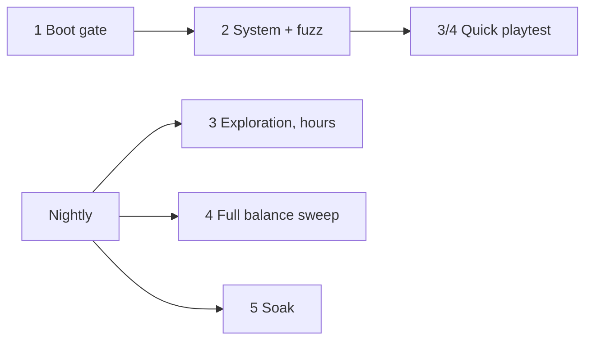

# Scurry

A rat roguelike in the browser: an open-world neighbourhood crawling with hordes on the surface, and a darker, meaner sewer below. Three.js, WebAudio, no assets. Everything (textures, models, music) is generated in code.

This is the production build of the **Scurry v5** design from Claude Design, plus the unfinished v6 overhaul from the design chat, now completed. The original prototypes and transcript are kept for reference in `project/` and `chats/`.

## Play it

**On GitHub Pages:** https://tayhastings1999-bot.github.io/Rat-Game/ (rebuilt automatically on every push to `main`).

Also hosted on claude.ai: https://claude.ai/artifact/Jfhgbb7RbS6iHANvSRPUoD (private to the owner until shared from the page's Share menu). Click a rat to start. Keyboard and mouse on desktop; on a phone or tablet, on-screen controls appear automatically (landscape works best).

## Run it

```bash
npm install
npm run dev        # http://localhost:5173
npm run build      # static site in dist/ (open with `npm run preview`, not file://)
npm run lint
npm run smoke      # headless end-to-end test (needs Chromium; see below)
npm run artifact   # build + package dist/artifact.html for hosting as a claude.ai Artifact
```

`npm run smoke` drives a real browser through the whole loop with zero tolerance for console errors. It covers the menu, a city run, interactions (chests, workbench, gnawing boards, climbing, power lines, key and manhole), corrupted elites, every boss through all three phases, the sewer and ladder, pause and map, death, the Nest, the new classes, a Ghost Trial finish, a horde soak, and a phone-sized touch session. It uses `/opt/pw-browsers/chromium` by default; set `CHROMIUM=/path/to/chrome` to override. Screenshots land in `scripts/out/`. Headless Chromium runs the game at roughly half speed, so waits in the script are generous.

Add `?debug` to the URL (or run the dev server) to get `window.__scurry` for poking at state.

## What's in the game

**Structure.** Each run starts in a procedural city district: a jittered street grid with sidewalks, alleys, buildings of different roof heights, parks, hedged yards, parking lots, cars, street lamps, neon, rooftop clutter and power lines between roofs. Smash the nests or outlast the timer to wake the district boss. Killing it opens a road to the next neighbourhood and drops a **sewer key**.

**The sewer (high-risk expansion).** Spend a key on the district's manhole to descend. Keys also drop from corrupted elites, and the Nest sells a starting key. Sewer layers are the six v5 districts (Undersewer → Rat King's Court). They have toxic water, zero-visibility pockets, mutated mobs (+50% HP, +25% damage, more elites), premium chests and cursed chests, and a big threat jump on entry. Beat the sewer boss and climb the ladder to the next surface district.

**Threat engine.** A volatile index that rises with time, depth, level, loot, cursed items and every decision (level-up picks, workbench installs, chests, mutations, entering the sewer). It spikes on kills and oscillates on its own. It scales enemy HP, damage, speed, attack rate, spawn rate, horde surges and elite odds.

**Pacing.** Mob types join the horde on a schedule (mawlings first, then roaches, bats, crows… shades last), each announced with a banner and fading in over a minute. Spawns ramp up with run time and threat, and every surge is followed by a short lull.

**Hidden places.** Cracked walls that look like plain brick hide secret passages (sniff with F to spot them; gnaw with E). Behind them: courtyards and pockets with premium loot, and each district's hidden **lair**, where a mini-boss (Alley Tom, Scrap Brute, Crow Matriarch, Bloated Queen, Ghoul Lord, Tick Hive) guards a premium hoard. Dead-end alleys always hold loot; fire escapes give a stamina-free way onto the roofs.

**Enemies.** Twelve types, each with several telegraphed attacks chosen by distance and sometimes by your HP. Flyers move erratically: bats weave on sine waves, screech and dive-bomb; crows orbit, reverse direction, swoop and fire feather volleys; moths drift in lissajous paths, drop poison clouds and blink; wasps dart. Big patrol cats hunt in packs. **Corrupted elites** have double HP plus a modifier: Burning (fire trail), Warding (shields allies), Frenzied, Brood-bloated (splits), Leeching or Volatile (explodes on death). They drop cores that give an item and salvage.

**Swarm combo.** Hits and kills fill a combo meter that drains fast and empties when you get hurt. Fill it to unlock the **territorial shriek** (X): eight nest-mates pour in for 10 seconds, biting everything nearby, staggering any boss within earshot and chewing through barricades. In a fight the controls hint and minimap fade out, and the boss bar only appears once you enter its arena.

**Momentum Scramble.** Sprint into a climbable wall and you run straight up it, free of stamina. Tap jump while on a wall to bounce off it; each chained bounce adds 10% speed (up to ×4) until you settle on the ground.

**Fungal foraging.** Mushrooms and molds grow against walls (far more in the sewer), shown as green dots on the minimap. Walk over one for a 10-second buff: Puffcap (+35% speed), Glowcap (+25% crit), Sporecap (toxic spore cloud), Iron Mold (−40% damage taken), Blood Mold (5 HP/s regen) or Slime Mold (free sprinting and climbing).

**Light and shadow.** The eye meter under stamina is your exposure. Street lamps, neon, the sweeping rooftop searchlights (city), light shafts through grates (sewer) and the Exterminator's flashlight all fill it; darkness drains it, and squeezing drains it faster. In shadow you regain stamina 50% faster and patrolling predators have to be almost on top of you to notice. Fill the meter and you're **spotted**: every cat nearby starts hunting you and a barn owl takes wing (bats in the sewer). The owl circles, screeches, then dives with its talons. Break line of sight in the dark and it loses you, circles wider and eventually gives up. Blackout districts kill the lamps but not the searchlights.

**Advanced Scent (F).** Sniffing drains the world to grey and lights up what your nose picks up in toxic colours: trails to exits, keys and loot; predator **view cones** (magenta while patrolling, red once they're hunting you); **fresh footprints** left by predators, elites, mini-bosses and bosses (bright when fresh, fading over ~20s); and pulsing rings on **gnaw points** (boards, hollow walls, ropes, live wires, traps, bins). Scent runs on an 8-second gauge that refills while your nose rests; the Pesticide Rag makes it endless. Cats only spot you inside their cone, which sweeps side to side, or when you're right on top of them, so reading the cones lets you slip past behind them.

**Physics traps.** Gnaw (hold E) a structural weak point and let the world do the fighting. Traps are placed along cat patrol routes first, and their damage scales with depth:
- *Frayed cable* (city: utility pole over a puddle; sewer: conduit over the channel). The cable drops into the water and electrifies it for ~9s: heavy damage and stuns to anything standing in it, including you. The old live-wire boxes now also electrify any water they're next to.
- *Scaffolding* against tall walls. It's climbable (the decks are platforms), but gnaw its pegs and it creaks, then collapses in tumbling planks that crush what's below and drop anyone on the decks.
- *Brick pallet* on a rooftop jib (city), with a faint ring on the ground where it'll land. Gnaw the tie-off and it drops, crushes everything in the ring and leaves a rubble heap you can hop on or hide behind.
- The sewer's rope-hung paint cans still work as before.

Bosses take a capped share of trap damage (5% of max HP from a crush) plus a stagger, so traps help but can't cheese a boss.

**Squeeze Network.** Every district has crawlspaces carved through its building blocks (and the sewer's wall mass), each linking two streets whose walk-around is much longer than the crawl. Look for the dark slots with a steel lintel and bent grille at the foot of a wall and just walk in: you squeeze automatically, and the camera cuts every building away at knee height so you can see the maze from above. Nothing on the streets can follow you (cats lose you, owls can't see you, the horde mills around at the mouths), and nothing lights you in there, but it isn't safe:
- *Exposed live wires* arc for a second every few seconds. Time your crawl.
- *Rival nests* in side chambers spit at you. You can fight inside the walls, and clearing one drops salvage and a big XP gem. Other chambers hold a cheese cache.

**Bosses.** Six, each with three phases (at 66% and 33% HP) that add attacks and speed. Every boss has a **brain** that watches how you fight:
- *It learns you.* Your preferred range, which way you circle it, which way you dodge-roll, and whether you're standing still.
- *It aims where you'll be.* Projectiles, pounces, charges, dives and ground marks lead you with a real intercept, nudged toward the side you usually dodge to. Circling bosses move the same way you do, so they cut you off instead of chasing.
- *It counters your style.* Kite it and it favours gap-closers; hug it and it shoves you off and zones you; camp and it punishes the spot. It sidesteps incoming projectiles, more often against ranged rats and in later phases.
- *Balance.* Every attack spends from an aggression budget. When a boss overextends it runs dry and is **EXPOSED** (sluggish, takes +25% damage). Dealing about 6% of its max HP in a quick burst breaks its poise into a 1.6s **STAGGER**. When you're below 25% HP bosses dodge less, recover slower and pick their biggest attacks less. Everything is still telegraphed.

Movement and signature moves:

| Boss | Where | Signature |
|---|---|---|
| The Horned Tabby | Cinder Row | cut-off circling, chained predictive pounces, feints that punish early rolls, rooftop stalking with a drop-pounce, hairball fans, swipe combos, slowing roar |
| The Murder King | Neon Market, Hollow Heights | hovers ahead of where you're running, feint swoops, crossfire volleys, feather storms, crow flocks, dive-bomb chains, tornado spiral |
| The Exterminator | Rust Yards | kites at range and jet-blinks away when you close in, a tracking sniper laser, traps laid along your path, poison spray, missiles, machine gun, flamethrower, fumigation |
| The Many-Mouthed | sewer | lead-aimed charges, burrows and surfaces where you're about to be, an inhale that drags you into its mouths, spit fans, spiral |
| The Brood Mother | sewer | skitters round to your back, webs your escape line, tick broods, hatching egg lobs, leaps, acid rain |
| The Rat King | sewer | rolls that ricochet off walls and re-aim at you, royal decrees stamped along your path, tail-whip rings, rat fans, vortex pull, prince adds |

**Moment to moment.**
- *Perfect dodge.* Roll through an attack in the first instant of the roll and time slows. You get two seconds of guaranteed crits, the roll's stamina back and a chunk of combo.
- *Cold open.* Runs start mid-chase, with a pack already on your tail. The first level comes quickly and the horde ramps up faster in the first district.
- *District events* (about every 75–100s, never during a boss fight or a breakthrough trial):
  - **Food truck crash**: a loot pile with a chest, food, salvage and gems, and the horde converging on it.
  - **Stampede**: a line of cats charges through. Get clear or get up high.
  - **Fumigation sweep**: a wall of gas rolls across the whole district. Get on a roof or into the walls; it shreds the horde.
  - **Roach tide**: a flood of weak roaches, which means easy XP.
  - **Wanted**: a marked elite with a bounty (salvage and a weapon crate). You have 60 seconds before it escapes.
- *Contracts.* Each run deals three jobs, shown under the minimap and on the pause screen. Completing one pays Dominance plus salvage on the spot. Untouchable (5 perfect dodges), Engineer (8 trap kills), In the Walls, Turf War, Forager, Dumpster Diver, Unseen (15 kills from shadow), Pack Call, Breakthrough, Bounty Hunter, Flawless (kill a boss without being hit) and Elite Hunter.

**District jobs.** The first district is always "smash the nests". After that, each district rolls a different job. Finishing it wakes the boss early and drops a premium chest plus salvage; the timer (a little longer now) still wakes the boss if you dawdle.
- *The Cheese Heist.* Grab the giant glowing wheel and carry it back to the gold ring at your start. It slows you, and the horde spawns twice as fast while you have it.
- *Rescue the Caged Rats.* Gnaw open three cages; each freed rat fights beside you for the rest of the run.
- *Light the Beacon.* Stand in the ring (usually on a rooftop) until it lights, while bats and crows come at you. The meter drains slowly when you step out.
- *Catch the Thief.* A gold rat runs away from you along the streets, scooping up your XP gems. Catch it three times to get them back with interest.

**Choose your road.** When a boss falls, up to three exits open, each labelled with what waits at the start of the next district: **Hoard** (premium chest), **Armory** (weapon crate), **Shrine** (a free Breakthrough-grade pick), **Safe House** (full heal and food), or **Blood Road** (+1.5 threat and +10% Dominance for the rest of the run, with a cursed chest and a premium chest). F sniffs out all of them in their colours.

**Rule breakers.** Rare upgrades that change how you play instead of adding a few percent. They turn up on about 1 in 6 level-ups, rising as you level, and on every Breakthrough:
- Ricochet Roll: rolls fire every weapon.
- Razor Roll: free rolls that slice everything you pass.
- Chain Reaction: kills burst for a quarter of the victim's max HP, and bursts chain.
- Shadow Paw: your primary also strikes a second target for 60%.
- Echo: your special casts twice.
- Glutton: food permanently adds damage.
- Swarm Frenzy: 40% faster attacks while your combo is over half full.
- Jackpot: an extra item from every chest.

**Characters and story.**
- *Boss intro cards.* Every boss gets an intro card with a title and a line ("Little thing. I can hear your heart from here."), plus a beat of slow-mo.
- *The story.* Each district opens with a story beat, from your burned nest to the Rat King's Court.
- *Scab.* Your rival rat shows up about half a minute into each district and runs for an unopened chest. He taunts you, steals the chest if he gets there, and escapes unless you catch him. Every time you beat him he comes back tougher; beat him three times and he gives up a Breakthrough-grade pick.
- *Chatter.* Rats you've freed shout warnings and banter.

**Ranks, score and sharing.**
- *District ranks.* Every district you clear gets a rank from S to D, stamped on screen. It's based on clear time, HP lost, perfect dodges and whether you finished the district job.
- *Run score.* Kills, damage, bosses, depth, contracts and ranks add up to a run score.
- *Run card.* The death screen has a **Share run card** button that makes a PNG card (your rat, score, stats, ranks and contracts) to post or send to friends.

**Daily Run.** On the menu. Everyone gets the same seeded districts and the same daily twist that day:
- Glass Rat
- Busy Streets
- Gold Rush
- Swift Paws
- Feast Day
- Lucky Day

You pick any rat, and a local best-of-the-day board keeps your top five scores.

**Leveling.** Built to feel smooth, with milestones you have to earn:
- *Even pace.* XP income rises with the threat (a tougher horde pays more), and if you fall behind the expected level for the run time you earn up to 50% extra until you catch up. Gems come in tiers: blue, green, red and violet.
- *Every level-up is a beat of relief.* A shockwave shoves the horde back, you heal 5%, and time slows for a moment.
- *Breakthroughs every 5 levels.* When the bar reaches level 5, 10, 15 and so on, it caps (turning gold, with extra XP banked) and a gold-ringed **Champion** elite comes for you with a few friends. Kill it within 45 seconds to break through: a big shockwave, a 30% heal, and a reward pick from 3–4 options (evolutions, **Keystones** and epic or legendary tomes). If time runs out it slinks off and comes back later; you're never locked out. Trials wait while a boss is right on top of you.
- *Keystones* are Breakthrough-only perks: Pack Leader (faster combo, +4 nest-mates), Second Wind (once per district, a 3s invulnerability and 25% heal when you drop below 30%), Carrion Feast (kills heal), Apex Hunter (+30% vs elites, champions, predators and bosses), Scrapper (+50% salvage, longer pickup reach), and Frenzied Growth (+20% XP, +10% speed).
- *Weapons.* A level-5 weapon plus its paired tome **evolves** at a Breakthrough: Rending Claws + Might → Butcher's Hooks, Tail Lash + Swiftness → Barbed Scourge, Plague Cloud + Hunger → Black Death, Rot Flask + Reach → Plague Barrage, Sling Stones + Plenty → Gatling Sling, Arc Lightning + Cunning → Storm Crown, Bone Halo + Hide → Ossuary Ring. Rarer tomes turn up more often as you level.
- *Pickups.* Champions drop a **weapon crate** (a free weapon level, or a new weapon if you have a slot) and **rat musk** (every gem on the map flies to you); elites sometimes drop musk too. Food drops four times as often when you're below 35% HP.

**Builds.**
- *Mutations.* Mundane ingredient items fuse in pairs into ten synergies, such as Box Cutter + Energy Drink → Livewire Claws, Lighter + Energy Drink → Napalm Trail, and Rubber Band + Fish Hook → Slingshot Recoil. Loot favours the partner of a half-finished recipe.
- *Cursed loot.* Six items with big upsides and permanent downsides, such as Rabid Bite: double damage, but you bleed out unless you keep hitting things.
- *Volatile junk.* Press E on dumpsters, trash cans and sewer junk heaps to rummage them (once each). You may find salvage, scraps of food, a nest of roaches, nothing, or one of four pieces of junk, each with an upside and a curse:
  - Leaking 9-Volt Battery: rolls leave an electric trail and attacks arc lightning, but it shocks you for 5% HP whenever you stand still for 2s.
  - Rusted Razor Blade: every hit stacks bleed, but max stamina drops 40%.
  - Pesticide Soaked Rag: every enemy shows on the minimap and you are immune to toxins, but healing is 75% less effective.
  - Heavy Lead Sinker: Q becomes a massive, uninterruptible ground slam, but Scramble is disabled and climbing costs double.
- *Bonk physics.* Knocked-back mobs smash into each other and take fall damage off rooftops.

**Meta (the Nest).** On death you bank two currencies:
- *Salvage* is unspent scrap plus a quarter of what you spent at workbenches. It buys HP, salvage gain, max stamina, pickup reach, level-up rerolls, a starting weapon, a spare key, and salvage-priced rats.
- *Dominance* is how hard you ruled the streets: kills/30 + damage/10,000 + 8 per boss + 3 per hidden lair + 2 per district deep. The death screen shows the breakdown. It buys:
  - Honed Fangs (+8% primary damage per rank)
  - Quick Paws (−5% weapon cooldowns per rank)
  - Deep Lungs (+15% stamina regen per rank)
  - Scavenged Arsenal (new weapons start at level 2)
  - two **shortcuts**: start in Neon Market (+25% Dominance) or straight in the Undersewer (+40%). Either way you get 3 free level-up picks at the start so you aren't underpowered. Pick where to start on the menu.

**Classes.** Melee rats (Gutter Brawler, Sewer Rat) lunge into range, heal a little on every hit, take 20% less damage from bites and build **Bloodlust** (faster attacks and movement) from kills. Gutter Brawler, Plaguebearer, Sewer Slinger, Rat Warlock, and two new ones: the **Sewer Rat** (tank: Gnash plus a reflecting Bulwark) and the **Roof Rat** (nimble: double jump, Needle Darts, Updraft glide). The **Sewer Sneak** unlocks at 60 lifetime Dominance (or buy it for 30): only 70 HP, but a 16-second scent gauge that refills twice as fast, a 70% faster squeeze, a **Shiv** that deals triple damage from ambush (after a second in shadow or smoke, or on a cat that hasn't noticed you) and 1.8× from behind, and a **Smoke Bomb** that hides you from predators and owls, makes hunting cats lose you, slows the horde inside and primes an ambush.

**Signature moves (G).** Each class has one move nobody else has:
- Gutter Brawler, *Grab & Hurl*: seize a mob and throw it into the pack (heavy mobs get shoved instead).
- Plaguebearer, *Blight Burst*: every poisoned mob within 12 bursts, hurting and poisoning its neighbours.
- Sewer Slinger, *Ricochet*: a piercing stone that banks off walls four times.
- Rat Warlock, *Hex Marks*: marks up to five mobs; the marks detonate two seconds later.
- Sewer Rat, *Shield Parry*: brace for half a second; the next hit is blocked, its attacker stunned, and nearby shots are thrown back.
- Sewer Sneak, *Shadowstep*: vanish and reappear behind the nearest mob with the ambush shiv ready.
- Roof Rat, *Dive Bomb*: leap, then plunge onto the nearest mob; the longer the drop, the harder it hits.

**How things move.** Every creature runs on a lightweight vertex skeleton (body, head, four legs, tail, two wings), so the whole horde stays instanced while it moves like animals:
- Strides come from the distance actually covered, so feet don't skate.
- Mobs steer with a turn rate and acceleration of their own: brutes and ghouls commit to a line, roaches whip around.
- They lean into turns, coil before an attack, snap out on the strike, and are briefly overextended afterwards. Hitting one then lands for +25% (**OPEN**).
- Heads track you, idle mobs sniff and look around, hits knock them wobbling away from the blow, and kills tumble as short ragdolls.
- Wind-ups glow by attack kind: **red = melee, purple = projectile, yellow = area** (green = a priest's heal). Ground warnings use the same colours.

The rat trots, breaks into a bounding gallop at a sprint, drags its tail like a chain, tracks threats with its head and squashes on landing. When idle it sniffs, grooms, scratches and rears up to look around. It limps and bleeds below 30% HP, scars as it gets hurt, and rears up roaring when a boss falls. Each class has its own silhouette: Brawler bandana and bottle-cap knuckles, Plague beak mask, Slinger Y-sling and feather, Warlock candle crown, Tank sardine-tin shell, Sneak sock hood, and Roof Rat glider skin.

**Mob roles.** Newer mobs each have a job and a counter:
- *Lidbearers* block hits from the front with a trash-can lid: flank them, hit them while they bash, or break the guard with a big hit.
- *Rot Priests* hang behind the pack and heal it: kill them first.
- *Lurkers* hide in alley cracks and burst out with a pounce: their eyes glint in the dark, and scent shows them.
- *Bin Mimics* pose as trash cans and rattle: rummage one and it bites. Each drops a weapon crate.
- *Gob Spitters* keep their distance and spit acid volleys.

Packs behave like packs:
- A third of mawlings circle behind you before they commit.
- Hurt fry flee, then come back enraged.
- When an elite dies, the pack around it howls and fights harder.
- Cats pounce on and eat mawlings.
- The shriek scatters crows and bats.
- The Exterminator's fire and traps hurt the horde too.

**Places.** City districts are no longer only streets:
- *Interiors.* Two to four buildings per district are enterable: diners, garages, apartments and laundromats. Each has a neon sign, and the camera cuts the walls away when you step inside. Back doors are bolted from the inside: unbolt one on your way out for a shortcut.
- *Laundromats.* Their washers run a spin cycle that drags the horde in and shreds it.
- *Cinder Row's night tram.* It rings its bells and sweeps one street about once a minute. Get clear, and lure the horde onto the rails.
- *Neon Market.* Stalls can be robbed for loot, but the alarm brings a wave.
- *Rust Yards.* A tower crane drops a steel load on the thickest crowd.
- *Hollow Heights.* Vegetable gardens are watched by a guard dog whose bark enrages every mob in earshot.
- *Elsewhere by chance.* Each of the above can also turn up in other districts.
- *Rain* falls on some districts: scent fades faster, lamps are dimmer and fog closes in.
- *Boss lairs.* Each boss wakes in a lair marked by a red beam: a rooftop garden, a dead tree full of nests, a warehouse whose gas vents poison everyone, bone arches, egg sacs that hatch ticks, the Rat King's throne.
- *Rooftop bridges.* Plank bridges cross alleys between rooftops.

**Music.** A procedural soundtrack: a distorted boom-bap drum loop with stuttering trap hi-hat rolls and a discordant phrygian/tritone synth bass. Tempo and density climb from exploring (132 BPM) to crowded fights (148). Bosses get their own **sinister score**, in a different key per boss (the Rat King's is a tritone off). While the boss is asleep you hear a detuned drone and a heartbeat. The fight brings a cold, wordless formant choir moving through a phrygian/diminished progression, a tolling FM church bell and half-time doom drums. Phase 2 adds taiko and a pulsing sub bass. Phase 3 adds a frantic diminished arpeggio, stuttering hats and the siren, and the tempo quickens from 88 to 96 BPM. Music and effects have separate volume sliders.

## Controls

WASD move · Space jump / hold on walls to climb · Shift tap to roll (i-frames), hold to sprint · C squeeze · Q special · G class signature move · X shriek (full combo) · E use / grab / hold to gnaw · R lock-on · F scent (8s gauge) · M map · mouse look (V toggles) · wheel zoom · Esc pause.

**Touch:** left stick moves, drag anywhere else to orbit the camera. Jump (hold on walls to climb), Roll (hold to sprint), Special, Sig (signature move), Use (hold to gnaw), Shriek (when the combo is full), Lock and Sniff sit on the right; Map and Pause at the top. Attacks aim themselves, so that's the whole game.

## QA pipeline

Five stages, cheapest first. Anything a script can check deterministically is a script; bots are used only where play is dynamic (exploration, balance, long sessions).

| Stage | Command | Kind | Time | What it checks | Runs |
|---|---|---|---|---|---|
| 1 · Boot gate | `npm run build && npm run test:boot` | Deterministic | ~15s | Production bundle loads, menu and every class card render, a run starts from the real button, the loop advances and draws, pause and resume, no console errors. | Every push |
| 2 · System, UI, fuzz | `npm run smoke && npm run test:system` | Deterministic + fuzz | ~2 min | Every button on every screen from fresh state. Damage, armour and i-frames; HP and XP bars; food healing and cap; kills and drops; mutation fusion; stamina; save round-trip. Random input, random teleports and random clicks with crash/NaN/out-of-bounds checks. | Every push |
| 3 · Exploration | `npm run playtest -- --hours=2` | Bots | hours | Static level checks over many districts, plain-language goals, the critical path, and an adversarial bot that tries to break out of the map: wall-hugging, edge and climb exploits, prop jumps, corner traps. | Quick version every push, full nightly |
| 4 · Combat + synergy | part of `npm run playtest` | Bots + statistics | ~20 min | Every class at three skill levels; every weapon at max, every evolution, rule, keystone and mutation, plus random combos, against a fixed horde. Flags builds that trivialise combat (>3× median damage) or do nothing, and damage spikes that take a third of HP in 5s. | Quick every push, full nightly |
| 5 · Soak | `npm run soak -- --hours=24` | Script driving bots | 24h+ | Back-to-back runs through the real menus with Nest purchases and page reloads. Heap, geometry, texture and scene-object trends per hour, logic cost as mobs scale, and save integrity (every key parses, lifetime totals never go down, the run counter goes up by exactly one). | Nightly (5.5h hosted) |



`.github/workflows/qa.yml` runs stages 1, 2 and the quick 3/4 on every push and pull request; each stage only starts if the previous one passed, and failures show as annotations on the run. `.github/workflows/nightly.yml` runs the long stages. GitHub-hosted jobs stop at 6 hours, so the hosted soak runs 5.5h; for 24 hours, pick a self-hosted runner when dispatching it, or run it locally. Reports land in `scripts/out/{system,playtest,soak}/`.

The bots (`src/qa/bot.js`, only loaded with `?debug`) play through the same inputs a player uses. *Novice* reacts in about 0.65s and dodges 15% of attacks; *average* in 0.3s and half; *expert* in 0.12s and 90%, keeping range and building toward evolutions. They take goals such as "kill the boss", "go inside a building", "loot every chest", "reach the manhole", "fail the run" or "break the level". Fast-forward steps the logic without drawing, roughly 25–100× real time. "Balancing" here is heuristic bots plus statistics, not trained models.

The game is single-player with no server, so the horde stress test stands in for online load. The bots measure stability, pacing and numbers. They can't tell whether movement feels good, the UI is clear or a story beat lands. That still needs people.

## Code map

```
src/
  main.js            boot + frame loop
  core/              util (math, RNG, storage) and shared state singletons
  render/            renderer + pixel post shader, procedural textures, creature models, instancing pools, rig.js (vertex skeleton)
  data/              classes, enemies/bosses/districts/modifiers, items/mutations/cursed/augments/Nest/corruptions, props
  world/             tile grid + collision, sewer and city generators, mesh builder + population, setpieces.js (interiors, tram, market, crane, gardens, lairs)
  entities/          player, rat model/portraits + ratAnim.js, mobs (AI + spawning), roles.js (new mob roles, pack behaviour), bosses
  combat/            damage/deaths/drops/threat, weapons & specials, hazards (telegraphs, puddles)
  game/              run flow (districts, sewer, banking), loot, update step, render sync + camera, input
  audio/             SFX + music sequencer
  ui/                HUD, screens (menu, Nest, pause, level-up, bench, endings), icons
scripts/boot.mjs     stage 1 boot gate; system.mjs stage 2 UI sweep, math checks, fuzzing
scripts/smoke.mjs    headless end-to-end test
scripts/soak.mjs     stage 5 long soak: leaks, degradation, save integrity
scripts/playtest.mjs bot playtests: performance, playability, balance (src/qa/ holds the bots and level checks)
scripts/gallery.mjs  animation gallery + frame-cost probe; rats.mjs class line-up; places.mjs set-piece tour
```

Game state lives in a few mutable singletons (`G`, `P`, `W`, `run`, `st`, `meta` in `core/state.js`) that modules import and mutate in place. Saves go to `localStorage` under `scurry.*`. Ghost Trial codes and leaderboards keep the `scurry4.*` keys so existing ghosts still load.

## Known gaps

- Touch controls are tuned for landscape phones and tablets; portrait works but is cramped.
- Ghost Trial sharing is still copy-paste codes. There's no online leaderboard.
- Balance (threat curve, boss HP, drop rates) comes from design intent and automated runs, not playtesting.
