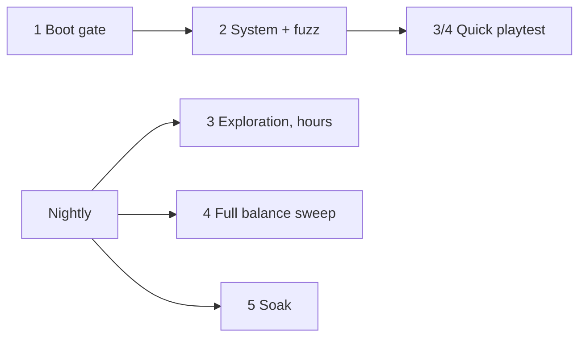

# Scurry

A rat brawler in the browser, being rebuilt around arcade dungeon-crawler mechanics: hordes pouring out of nests on the surface, and a darker, meaner sewer below. Three.js, WebAudio, no assets. Everything (textures, models, music) is generated in code.

This is the production build of the **Scurry v5** design from Claude Design, plus the unfinished v6 overhaul from the design chat, now completed. The original prototypes and transcript are kept for reference in `project/` and `chats/`.

## Play it

**On GitHub Pages:** https://tayhastings1999-bot.github.io/Rat-Game/ (rebuilt automatically on every push to `main`).

Also hosted on claude.ai: https://claude.ai/artifact/Jfhgbb7RbS6iHANvSRPUoD (private to the owner until shared from the page's Share menu). Click a rat to start. Keyboard and mouse on desktop; on a phone or tablet, on-screen controls appear automatically (landscape works best).

## Run it

```bash
npm install
npm run dev        # http://localhost:5173
npm run build      # static site in dist/ (open with `npm run preview`, not file://)
npm run lint
npm run smoke      # headless end-to-end test (needs Chromium; see below)
npm run artifact   # build + package dist/artifact.html for hosting as a claude.ai Artifact
```

`npm run smoke` drives a real browser through the whole loop with zero tolerance for console errors. It covers the menu, a city run, XP and automatic level-ups, interactions (chests, gnawing boards, climbing, power lines, bins, key and manhole), corrupted elites, every boss through all three phases, the sewer and ladder, pause and map, death and gold banking, every class, a horde soak, and a phone-sized touch session. It uses `/opt/pw-browsers/chromium` by default; set `CHROMIUM=/path/to/chrome` to override. Screenshots land in `scripts/out/`. Headless Chromium runs the game at roughly half speed, so waits in the script are generous.

Add `?debug` to the URL (or run the dev server) to get `window.__scurry` for poking at state and the **Tune** panel for live-editing `src/tuning.js`.

## What's in the game

**Rebuild in progress.** Scurry is being rebuilt into a single-player dungeon brawler: a walkable hub, two realms of zones, a fixed camera, direct aim combat, constant health drain, generators (nests) that pour out one enemy family each, keys and treasure, and persistent heroes from level 1 to 99. The work lands in phases. **Phase 1** cut the roguelite layer (the threat engine, level-up picks, weapons and tomes, rule breakers, mutations, cursed loot, the Nest shop, the Daily Run, contracts, the shriek, stamina, the light meter and the road choice). **Phase 2 (this build)** added the combat core: a fixed camera that sees through walls, four class stats, the turbo meter and moves, Rot Vials, constant health drain with three sizes of food (some of it moldy, all of it breakable), tiered nests that each raise one enemy family, the Reaper, thieves and a low-health announcer. Later phases add fixed levels, power-ups, secrets, the hub and the new progression.

**Structure.** A run is a chain of procedural city districts: a jittered street grid with sidewalks, alleys, buildings of different roof heights, parks, yards, parking lots, cars, street lamps, neon, rooftop clutter and power lines between roofs. **Smash every nest to wake the district boss.** Killing it opens a single road to the next neighbourhood and drops a **sewer key**.

**The sewer.** Spend a key on the district's manhole to descend. Keys also drop from corrupted elites. Sewer layers are the six v5 districts (Undersewer → Rat King's Court) with toxic water, zero-visibility pockets, mutated mobs (+50% HP, +25% damage, more elites) and premium and cursed chests. Beat the sewer boss and climb the ladder to the next surface district.

**Difficulty by zone.** Enemy strength comes from a per-zone table instead of the old threat engine: each zone has a difficulty index (`zone.threatPerZone` × zone number) that scales enemy HP, damage, speed, attack rate and elite odds. All of it lives in `src/tuning.js`.

**Nests.** Nests are where the horde comes from. Between them, a light trickle of street spawns (about a third of the old rate, `nests.ambient`) draws only from the zone's own families; horde surges are off (`nests.surges`). Each nest raises one **family**, and zones list which families they draw from:

| Family | Litter Pile | Burrow | Warren |
|---|---|---|---|
| Vermin | roaches | ticks | mawlings |
| Wings | bats | wasps | crows |
| Rot | gob spitters | ghouls | bloats |
| Prowlers | feral cats | shades | moths |
| Guards | lidbearers | rot priests | brutes |

A **Litter Pile** (160 HP) spawns slowly and keeps 6 children; a **Burrow** (320) is faster and keeps 10; a **Warren** (560) spawns every ~2s and keeps 14. Damage knocks a nest down a tier as its HP falls (a half-smashed Warren is a Burrow), and each nest sometimes raises its family's weaker member. Later zones have more nests, more Warrens and more HP. A type's first appearance gets a banner. At most 200 enemies are alive at once.

**Leveling.** Kills pay XP straight into your bar (nests 15/25/40 by tier, rivals 40, bosses 220). Level-ups are automatic: a banner, a shockwave that shoves the horde back and a small heal. There are no picks. XP to the next level is `base + lin·(L−1) + mul·(L−1)^exp`, capped at level 99.

**Gold.** Chests, bins, bounties and kills drop **gold** (the old salvage). Chests are free to open. Gold you carry is banked when the run ends and shows on the menu; the shop that spends it arrives in Phase 4.

**Hidden places.** Cracked walls that look like plain brick hide secret passages (sniff with F to spot them; gnaw with E). Behind them: courtyards and pockets with loot, and each district's hidden **lair**, where a mini-boss (Alley Tom, Scrap Brute, Crow Matriarch, Bloated Queen, Ghoul Lord, Tick Hive) guards a hoard. Dead-end alleys always hold loot; fire escapes are a way onto the roofs.

**Enemies.** Twelve types, each with several telegraphed attacks chosen by distance and sometimes by your HP. Flyers move erratically: bats weave, screech and dive-bomb; crows orbit, swoop and fire feather volleys; moths drift, drop poison clouds and blink; wasps dart. Big patrol cats hunt in packs. **Corrupted elites** have double HP plus a modifier: Burning (fire trail), Warding (shields allies), Frenzied, Brood-bloated (splits), Leeching or Volatile (explodes on death).

**Combo.** Hits and kills fill a combo meter that drains fast and empties when you get hurt. In a fight the controls hint and minimap fade out, and the boss bar only appears once you enter its arena.

**Fungal foraging.** Mushrooms and molds grow against walls (far more in the sewer), shown as green dots on the minimap. Walk over one for a 10-second buff: Puffcap (+35% speed), Glowcap (+25% crit), Sporecap (toxic spore cloud), Iron Mold (−40% damage taken), Blood Mold (5 HP/s regen) or Slime Mold (faster climbing).

**Scent (F).** Sniffing drains the world to grey and lights up what your nose picks up: trails to the exit, keys and loot; predator **view cones** (magenta while patrolling, red once they're hunting you); **fresh footprints** left by predators, elites, mini-bosses and bosses; and pulsing rings on **gnaw points** (boards, hollow walls, ropes, live wires, traps, bins). Scent runs on an 8-second gauge that refills while your nose rests.

**Physics traps.** Gnaw (hold E) a structural weak point and let the world do the fighting:
- *Frayed cable* over water. It drops in and electrifies the water for ~9s: heavy damage and stuns to anything standing in it, including you.
- *Scaffolding* against tall walls. Climbable, but gnaw its pegs and it collapses on what's below.
- *Brick pallet* on a rooftop jib, with a ring on the ground where it'll land.
- The sewer's rope-hung paint cans.

Bosses take a capped share of trap damage (5% of max HP from a crush) plus a stagger.

**Squeeze Network.** Crawlspaces carved through building blocks link two streets whose walk-around is much longer than the crawl. Walk into the dark slots at the foot of a wall and you squeeze automatically; the camera cuts the buildings away so you can see the maze. Nothing on the streets can follow you, but *exposed live wires* arc every few seconds and *rival nests* in side chambers spit at you (clearing one pays gold and XP). Other chambers hold a cheese cache.

**Bosses.** Six, each with three phases (at 66% and 33% HP) that add attacks and speed. Every boss has a **brain** that learns your preferred range, circling direction and dodge side, leads its attacks with a real intercept, and counters your style (gap-closers against kiters, shoves against huggers). Attacks spend from an aggression budget: overextend and it's **EXPOSED** (+25% damage taken); burst about 6% of its max HP quickly and it **STAGGERs** for 1.6s. Melee rats can swat flying bosses up to `combat.meleeFlyReach` above them.

| Boss | Where | Signature |
|---|---|---|
| The Horned Tabby | Cinder Row | cut-off circling, chained predictive pounces, feints, rooftop drop-pounce, hairball fans, swipe combos, slowing roar |
| The Murder King | Neon Market, Hollow Heights | hovers ahead of you, feint swoops, crossfire volleys, feather storms, crow flocks, dive-bomb chains, tornado spiral |
| The Exterminator | Rust Yards | kites and jet-blinks away, tracking sniper laser, traps along your path, poison spray, missiles, machine gun, flamethrower, fumigation |
| The Many-Mouthed | sewer | lead-aimed charges, burrows and surfaces ahead of you, inhale pull, spit fans, spiral |
| The Brood Mother | sewer | skitters to your back, webs your escape line, tick broods, egg lobs, leaps, acid rain |
| The Rat King | sewer | ricocheting rolls, royal decrees along your path, tail-whip rings, rat fans, vortex pull, prince adds |

**Moment to moment.**
- *Perfect dodge.* Dodge through an attack in its first instant and time slows; you get two seconds of guaranteed crits and a chunk of combo. Dodges have a 1.2s cooldown.
- *District events* (about every 75–100s, never during a boss fight): **Food truck crash** (a loot pile the horde converges on), **Stampede** (cats charge through), **Fumigation sweep** (a wall of gas; get on a roof or into the walls), **Roach tide** (easy XP) and **Wanted** (a marked elite that pays gold and supplies if you catch it within 60s).

**Side objectives.** The first district is always "smash the nests". Later districts add a side job on top of the nests; finishing it pays a premium chest and gold:
- *The Cheese Heist.* Carry the giant glowing wheel back to the gold ring at your start. It slows you, and the horde spawns twice as fast while you have it.
- *Rescue the Caged Rats.* Gnaw open three cages. Freed rats run home; they don't fight.
- *Light the Beacon.* Stand in the ring until it lights while flyers come at you.
- *Catch the Thief.* A gold rat runs off with your gold. Catch it three times to get it back with interest.

**Characters, ranks and sharing.**
- *Boss intro cards* with a title, a line and a beat of slow-mo.
- *Scab*, your rival, shows up about half a minute into each district and runs for an unopened chest. Beat him three times and he gives up a stash of supplies.
- *District ranks* from S to D (clear time, HP lost, perfect dodges, side job), a *run score*, and a **Share run card** PNG on the death screen.

**Classes and stats.** Seven rats, all open from the start. Each has four stats from 1 to 10 (`TUNE.classes`), shown on its menu card: **Strength** scales primary attack damage, **Speed** sets move speed and attack and cooldown rate, **Armor** cuts damage taken (5.5% per point), and **Magic** scales specials, signatures, turbo and vials and fills the turbo meter faster.

| Rat | HP | STR | SPD | ARM | MAG | Kit |
|---|---|---|---|---|---|---|
| Gutter Brawler | 170 | 8 | 5 | 6 | 3 | Claw Rake, Leap Slam, Grab & Hurl, life-steal 0.3/hit, Bloodlust |
| Plaguebearer | 120 | 4 | 4 | 4 | 8 | Blight Lob, Plague Nova, Blight Burst |
| Sewer Slinger | 120 | 5 | 8 | 4 | 4 | Sling Stone, Stone Volley, Ricochet |
| Rat Warlock | 100 | 3 | 5 | 2 | 10 | Hex Bolt, Blink, Hex Marks |
| Sewer Rat | 215 | 6 | 3 | 9 | 4 | Gnash, Bulwark, Shield Parry, life-steal 0.6/hit, Bloodlust |
| Sewer Sneak | 90 | 6 | 9 | 2 | 5 | Shiv (1.8× from behind), Smoke Bomb, Shadowstep |
| Roof Rat | 95 | 4 | 9 | 2 | 7 | Needle Darts, Updraft, Dive Bomb, double jump |

The Sewer Sneak no longer relies on stealth: its Smoke Bomb blinds the horde inside (they take 1.3× damage and are slowed) instead of hiding you from predators, and it has the standard scent gauge and squeeze.

**Turbo (X).** Damage you deal fills a three-segment turbo meter under your health (Magic fills it faster). **Tap X** for your class **turbo blast**, which spends every full segment and grows with how many (×1, ×1.75, ×2.5): Knuckle Quake (Brawler), Plague Tide, Stone Storm, Hex Storm, Iron Wall (Sewer Rat), Thousand Cuts (Sneak) and Sky Rain (Roof Rat). **Hold X and press Q or G** for the turbo version of your special or signature: one segment, ignores the cooldown, double damage and a 1.5× radius, plus a twist (a second ring of stones, a poisoning nova, a burning smoke cloud, a longer Bulwark, a longer Blink). Hold X and let go without pressing anything and turbo stays armed for 1.5s, which is how touch players use it.

**Rot Vials (Z).** Carry up to 9 (you start with 1). Throwing one bursts rot around you: heavy damage to everything within 11 units, nests and bosses included, plus poison. Vials turn up in chests (30%, premium always), bins and on corrupted elites, and lie on the floor as green flasks.

**Food and health drain.** Your health drains all the time: 0.5 HP/s in the first zone, +0.1 per zone after. Run out and you starve. Food is the way back: **crumbs** (25 HP) from kills, **cheese wedges** (60) from nests, chests and bins, and whole **caches** (120) from premium chests, predators and hidden pockets. Your own shots, swipes and area attacks **destroy food** they touch (a shot stops there), so watch where you aim; vials and turbo blasts don't. Some food is **moldy** (12% on the surface, 25% in the sewer): it looks the same, but eating it poisons you. Sniff (F) and moldy food glows green. When health dips below 30% and again below 12%, the **announcer** calls it out; its voice (your browser's built-in speech) can be turned on in the pause menu.

**The Reaper.** From the second zone on, if you're still in a zone after 150 seconds, the Reaper rises. It glides straight at you through walls, slower than any rat, and its touch drains 22 HP/s. Claws and shots only push it back; a **Rot Vial** or a **turbo blast** hurts it, and one vial usually banishes it (gold, a cache and 300 XP). If it drains 120 HP it fades, and comes back 90 seconds later if you're still dawdling.

**Thieves.** About every 80 seconds a gold-tinted thief sprints at you, snatches a Rot Vial (or a fifth of your gold) and flees along the streets. It's gone for good after 12 seconds. Catch it to get everything back, plus a tip.

**Signature moves (G).** Grab & Hurl (Brawler), Blight Burst (Plaguebearer), Ricochet (Slinger), Hex Marks (Warlock), Shield Parry (Sewer Rat), Shadowstep (Sneak: reappear behind the nearest mob, facing its back) and Dive Bomb (Roof Rat).

**Camera.** A fixed-angle follow camera (`TUNE.camera`; the wheel zooms). It never moves to dodge buildings: anything between the camera and the rat gets a dithered see-through hole around the rat instead, so you're never hidden. Inside crawlspaces and buildings the camera tips over to look down into the cutaway.

**How things move.** Every creature runs on a lightweight vertex skeleton (body, head, four legs, tail, two wings), so the whole horde stays instanced while it moves like animals: strides follow distance covered, mobs lean into turns, coil before an attack and are briefly **OPEN** (+25% damage) after it. Wind-ups glow by attack kind: **red = melee, purple = projectile, yellow = area** (green = a priest's heal). Each class has its own silhouette.

**Mob roles.** *Lidbearers* block from the front (flank them); *Rot Priests* heal the pack (kill them first); *Lurkers* hide in cracks and pounce; *Bin Mimics* pose as trash cans and bite when rummaged; *Gob Spitters* keep their distance and spit acid. A third of mawlings circle behind you; hurt fry flee and come back enraged; cats eat mawlings.

**Places.** Enterable diners, garages, apartments and laundromats (whose washers shred the horde); Cinder Row's night tram; Neon Market stalls that can be robbed (the alarm brings a wave); Rust Yards' tower crane; Hollow Heights' guard dogs; rain; boss lairs marked by a red beam; rooftop plank bridges.

**Music.** A procedural soundtrack: boom-bap drums with trap hi-hat rolls and a discordant phrygian bass that climbs from 132 to 148 BPM in crowded fights. Each boss gets its own score (choir, FM bell, doom drums) that intensifies per phase. Music and effects have separate volume sliders.

**Tuning and the debug panel.** Every rebuilt number lives in `src/tuning.js` (`TUNE`): camera, stats and classes, turbo, vials, nests, the Reaper, thieves, food and the announcer among them. Open the game with `?debug` and a **Tune** button appears on the right edge: it lists every value by group and edits them live (class stat edits re-apply to your rat at once). Older numbers move into the file as their systems are rebuilt.

## The story

**Wick and Bram.** The night Cinder Row burned, Wick ran and told the nest that their littermate Bram died under the falling beams. Bram didn't die. He heard Wick run. He crawled into the sewer, was taken in by the Rat King's Court, and learned the King sells whole colonies to the Exterminator so his Court stays fed. Bram, now **Scab**, lit the fire on Cinder Row himself to drive the nest out before the poison came. He saved them, and he can't forgive them for leaving him. His answer is the Knot: tie every rat to every other by the tail so no one is ever left behind again.

The theme is the game's core verb. Running keeps you alive; going back is what makes you worth keeping. Wick's flaw (run, alone) and Scab's (hold on, by force) are the same wound. Scab is right about the threat and never lies to you. He feeds the Court's runts first, coughs from the smoke, and can't stand the dark. He is also the rat who steals your chests, lays poison in your path, takes Pip to see whether you'll go back, and spends the whole story making you strong enough to kill the King for him.

**Chapters** unlock across runs as you hit milestones in play, and are saved:

| # | Chapter | How it moves on |
|---|---|---|
| 1 | Smoke | Catch the chest thief |
| 2 | A Dead Rat Walking | Reach a second district |
| 3 | Pip | Free the caged rats; Pip is in the last cage |
| 4 | Pest Control | Beat a boss in your third district or deeper (the Exterminator in Rust Yards) |
| 5 | Below | Take a manhole into the sewer |
| 6 | The Court of Tails | Beat the Rat King in the deep sewer |
| 7 | Crown of Tails | Beat Scab, the Knotted King |

**Choices change play.** When you first catch Scab you can let him go, rob him (his supplies and gold, right now) or tell him you're sorry. After the Exterminator you can help him against the King (he stops robbing you and leaves supplies in each district) or refuse (he comes for your chests with a crew). From chapter 2 he lays stolen Exterminator poison as he runs. Once he's crowned he stops stealing; he's waiting for you as the final boss. (Phase 4 moves Pip and Bram into the hub; for now Pip no longer fights beside you.)

**Bonds and endings.** Every caged rat you free, saving Pip, sparing Scab (and owning what you did) is a bond: proof Wick has learned to go back. The finale offers three endings, and **cutting Scab free of the Knot needs 8 bonds**; freeing Pip alone won't get you there. Each ending leaves a mark on every run after it: *Going Back* (healing ×1.15), *Still Running* (+8% speed) or *Long Live the King* (+10% damage dealt, +10% damage taken).

Scenes pause the game. Space or a tap advances, Esc skips to the choice, 1–3 choose. The pause screen has a journal of chapters, choices and bonds. Harness runs (`?debug`) resolve scenes instantly so the bots and tests aren't interrupted.

## Controls

WASD move · mouse aims on the ground · left click or J attacks (hold to repeat) · Shift dodge (1.2s cooldown, i-frames) · Space jump / hold on walls to climb · C squeeze · Q special · G class signature move · X turbo (tap: blast; hold + Q/G: turbo special or signature) · Z Rot Vial · E use / grab / hold to gnaw · R lock-on · F scent (8s gauge) · M map · wheel zoom · Esc pause. The camera follows at a fixed angle. The pause menu repeats all of this under **Controls**.

**Touch:** the left stick moves. Hold **Attack** to fire at the nearest enemy in a cone in front of you (no cone target: straight ahead). On the right: Lock, Sniff and Vial; Special, Sig and **Turbo** (tap for the blast; hold it, let go, then tap Special or Sig within 1.5s for the turbo version); Use (hold to gnaw), Dodge and Jump (hold on walls to climb). Map and Pause sit at the top.

## QA pipeline

Five stages, cheapest first. Anything a script can check deterministically is a script; bots are used only where play is dynamic (exploration, balance, long sessions).

| Stage | Command | Kind | Time | What it checks | Runs |
|---|---|---|---|---|---|
| 1 · Boot gate | `npm run build && npm run test:boot` | Deterministic | ~15s | Production bundle loads, menu and every class card render, a run starts from the real button, the loop advances and draws, pause and resume, no console errors. | Every push |
| 2 · System, UI, fuzz | `npm run smoke && npm run test:system` | Deterministic + fuzz | ~2 min | Every button on every screen from fresh state. Damage, armour and i-frames; HP and XP bars; XP auto level-up; food healing and cap; kills and drops; dodge cooldown; held attack toward the aim point; save round-trip. Random input, random teleports and random clicks with crash/NaN/out-of-bounds checks. | Every push |
| 3 · Exploration | `npm run playtest -- --hours=2` | Bots | hours | Static level checks over many districts, plain-language goals, the critical path, and an adversarial bot that tries to break out of the map: wall-hugging, edge and climb exploits, prop jumps, corner traps. | Quick version every push, full nightly |
| 4 · Combat + synergy | part of `npm run playtest` | Bots + statistics | ~20 min | Every class at three skill levels (bots aim and attack manually with profile-based aim error, eat, sniff out mold, throw vials and use turbo) and a class kit sweep in which each class hunts the zone's nests. Flags kits that trivialise combat (>3× median damage) or do nothing, and damage spikes that take a third of HP in 5s. | Quick every push, full nightly |
| 5 · Soak | `npm run soak -- --hours=24` | Script driving bots | 24h+ | Back-to-back runs through the real menus with page reloads. Heap, geometry, texture and scene-object trends per hour, logic cost as mobs scale, and save integrity (every key parses, lifetime totals never go down, the run counter goes up by exactly one). | Nightly (5.5h hosted) |



`.github/workflows/qa.yml` runs stages 1, 2 and the quick 3/4 on every push and pull request; each stage only starts if the previous one passed, and failures show as annotations on the run. `.github/workflows/nightly.yml` runs the long stages. GitHub-hosted jobs stop at 6 hours, so the hosted soak runs 5.5h; for 24 hours, pick a self-hosted runner when dispatching it, or run it locally. Reports land in `scripts/out/{system,playtest,soak}/`.

The bots (`src/qa/bot.js`, only loaded with `?debug`) play through the same inputs a player uses. *Novice* reacts in about 0.65s and dodges 15% of attacks; *average* in 0.3s and half; *expert* in 0.12s and 90%, keeping range. Each aims with its own error (1.6, 0.7 and 0.15 units) and holds attack like a player. They take goals such as "kill the boss", "go inside a building", "loot every chest", "reach the manhole", "fail the run" or "break the level". Fast-forward steps the logic without drawing, roughly 25–100× real time. "Balancing" here is heuristic bots plus statistics, not trained models.

The game is single-player with no server, so the horde stress test stands in for online load. The bots measure stability, pacing and numbers. They can't tell whether movement feels good, the UI is clear or a story beat lands. That still needs people.

## Performance

Everything that comes in large numbers (mobs, gold, projectiles, particles, gibs, blood decals, blob shadows) is drawn as instanced meshes, a few draw calls in total. The scene renders at a low PS1-like resolution that drops automatically when frames run long. Late in a run the cost is the horde itself, so:

- *AI level of detail.* Mobs more than 34 units away (off-screen) think every third frame and catch up on the time they skipped. Bosses, champions and patrolling predators always run at full rate.
- *Off-screen culling.* Mobs outside the camera view skip animation and GPU upload.
- *Caps.* At most 200 live enemies (`enemies.cap`); gold, particles and gibs have fixed pools.

Profiling a 7-minute late-game scene showed mob AI at 26µs per mob and 300+ nest-mates piling up; after these changes it's about 10µs per mob, and frame CPU fell by roughly a third with more mobs on screen.

## Code map

```
src/
  main.js            boot + frame loop
  core/              util (math, RNG, storage) and shared state singletons
  render/            renderer + pixel post shader, procedural textures, creature models, instancing pools, rig.js (vertex skeleton), fade.js (see-through hole)
  tuning.js          every rebuilt gameplay number (TUNE), edited live by the ?debug panel
  data/              classes, enemies/bosses/districts/modifiers, corruptions, props
  world/             tile grid + collision, sewer and city generators, mesh builder + population, setpieces.js (interiors, tram, market, crane, gardens, lairs)
  entities/          player, rat model/portraits + ratAnim.js, mobs (AI + spawning), roles.js (new mob roles, pack behaviour), bosses
  combat/            damage/deaths/drops/zone scaling, primaries & specials, hazards (telegraphs, puddles)
  game/              run flow (districts, sewer, banking), progress (XP, levels, gold), stats (class stats), turbo, vials, food (drain, sizes, mold),
                     nests (tiers, families), reaper, thieves, announcer, loot, update step, render sync + camera, input, story.js
  audio/             SFX + music sequencer
  ui/                HUD, screens (menu, pause, map, death, endings), debugPanel.js, icons
scripts/boot.mjs     stage 1 boot gate; system.mjs stage 2 UI sweep, math checks, fuzzing
scripts/smoke.mjs    headless end-to-end test
scripts/soak.mjs     stage 5 long soak: leaks, degradation, save integrity
scripts/playtest.mjs bot playtests: performance, playability, balance (src/qa/ holds the bots and level checks)
scripts/gallery.mjs  animation gallery + frame-cost probe; rats.mjs class line-up; places.mjs set-piece tour
```

Game state lives in a few mutable singletons (`G`, `P`, `W`, `run`, `st`, `meta` in `core/state.js`) that modules import and mutate in place. Saves go to `localStorage` under `scurry.*`. Phase 1 drops the old Nest purchases and the `scurry4.*` / `scurry.daily.*` keys on load; banked salvage carries over as gold.

## Known gaps

- Touch controls are tuned for landscape phones and tablets; portrait works but is cramped.
- Mid-rebuild (Phase 2 of 5): there's no hub, power-ups, shop or save slots yet, levels are still freshly generated each run, and gold has nothing to buy.
- Turbo specials and signatures are the normal move with more damage and radius plus a small twist, not bespoke animations.
- Climbing still works on any wall; Phase 3 limits it to marked pipes and fire escapes.
- Balance (zone table, boss HP, drop rates) comes from design intent and automated runs, not playtesting.
